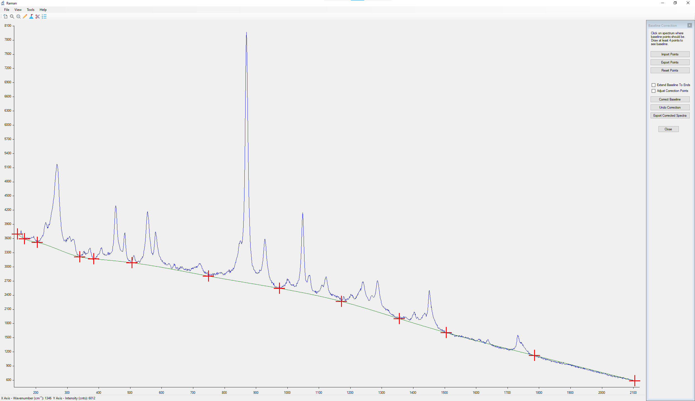
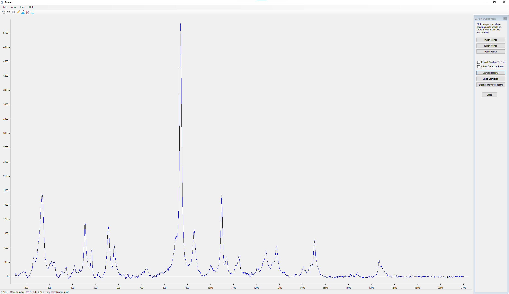
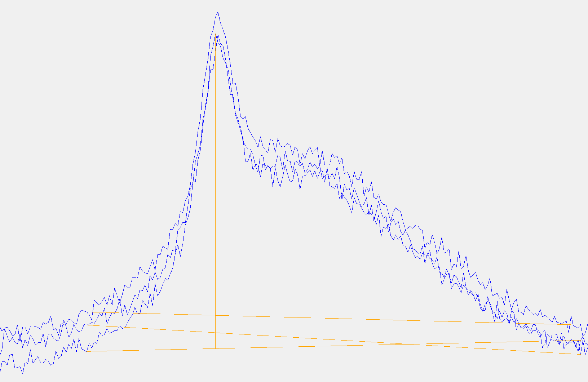

# Raman Spectrum Analysis Software

Program is designed for analyzing Raman and infrared spectra but can also be used to display and measure any chart data defined by data points saved in TXT or CSV file.

## Key Features

- **Baseline Correction**: Manually set baseline points to correct spectra.
- **Peak Measurement**: Measure peak height and calculate the area under peaks.
- **Zooming**: Intuitive zoom with mouse scroll, including zoom windows and reset to original view.
- **Distance Measurement**: Measure distances within the chart for precise analysis.
- **Compatibility**: Compatible with Windows 10 and 11.

## Data Import Options

**Demo Data**

A sample file, spectrum.csv, is provided in the demo-data folder for testing program features.

**Single Spectrum Files**

- Supports opening single or multiple spectrum files in TXT or CSV format.
- **Format Requirements**:
  - Each line should contain two values separated by a comma or dot (TXT files use tabs or spaces as delimiters, with a dot or comma as the decimal delimiter).
  - CSV files require comma-separated values, with dots as decimal delimiters.

**Multi-Spectrum Files**

- Supports opening multiple spectrum files simultaneously.
- **Format Requirements**:
  - The first line contains x-coordinates.
  - Each subsequent line contains y-coordinates for individual spectra.
  - Values in TXT files should be space-separated, values in CSV files should be comma separated.

**Clipboard Import**

- Data can also be imported from the clipboard, formatted with tab-separated x and y values (e.g., from Excel).

## View Menu

- **Zooming**: Zoom in and out using the mouse scroll wheel; drag with the middle mouse button to adjust the view.
- **Zoom Window**: Draw a rectangle to zoom into a specific area of the spectrum.
- **Reset View**: Quickly return to the original spectrum size.

## Tools Menu

**Baseline Correction**

- Define at least four baseline points by clicking on the spectrum.
- Remove points by right-clicking and selecting “Remove Closest Point” or by holding Ctrl and pressing the middle mouse button.

_Before Baseline Correction_

_After Baseline Correction_

**Peak Analysis**

- Define start and end of the peak for peak measurement.
- Exported peak format: Spectrum_Name, Peak_Number, Peak_Start, Peak_End, Peak_Height, Peak_Top_Position, Area.
- Remove points by right-clicking and selecting “Remove Closest Point” or by holding Ctrl and pressing the middle mouse button.

**Cut-Off Functionality**

Allows you to trim the left and right sections of the spectrum as needed.

**Measurement Tool**

Measure x and y distance between two user-defined points. The distance is displayed in the status bar.

## Configuration

- Config File: Raman.json
- Set decimal places for x and y values shown in the application status bar or export files:
  - XDecimalPlaces: Default is 0.
  - YDecimalPlaces: Default is 2.